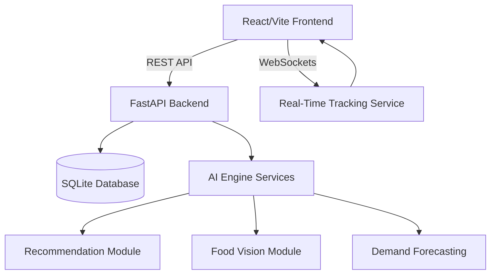

# 🧠 Feasto.ai | Food Intelligence Platform

> **Feasto AI Platform – Food Delivery Intelligence Prototype**

Built a full-stack food delivery prototype using React, FastAPI, SQLite, and WebSockets. Designed AI-powered recommendation, nutrition analysis, and demand forecasting workflows as proof-of-concept modules demonstrating how intelligent decision systems can be integrated into modern food delivery platforms.

## 🏗️ Architecture & Tech Stack



**Frontend (User Interface & State):**
* **React + Vite:** Lightning-fast rendering and module bundling.
* **Tailwind CSS + Framer Motion:** Premium, glassmorphism UI with fluid animations.
* **Zustand:** Lightweight, centralized state management (Smart Cart).
* **Recharts:** Interactive data visualization for the Nutrition Twin dashboard.

**Backend (Data Engineering & Concept ML):**
* **FastAPI (Python):** High-throughput, asynchronous API endpoint architecture.
* **SQLite / SQLAlchemy:** Relational database modeling for user state.
* **WebSockets:** Event-driven infrastructure for real-time delivery tracking telemetry.
* **NumPy, Pandas & Scikit-Learn:** Data processing, algorithmic filtering, and predictive machine learning models.

## ✨ Core Proof-of-Concept Features

* **The AI Food Concierge:** A recommendation engine prototype that processes user constraints to return mathematically optimized meal options using algorithmic content-based filtering.
* **Demand Forecasting:** A Scikit-Learn linear regression model trained on synthetic historical data to predict future restaurant volume based on weather and calendar features.
* **Digital Nutrition Twin:** A real-time data visualization module that tracks macro-nutritional intake against active burn and caloric deficits.
* **Real-Time Tracking:** Native WebSocket integration simulating real-time GPS and status updates (Preparing → Cooking → Arriving).

## 🚀 Quick Start (Native Environment)

To ensure the application runs efficiently without heavy containerization overhead, the backend is optimized to run via native SQLite and Python virtualization.

### 1. Start the Intelligence Backend
```bash
cd backend
python -m venv venv
source venv/Scripts/activate  # (or .\venv\Scripts\activate on Windows)
pip install -r requirements.txt
uvicorn app.main:app --reload
```
*The API will be available at `http://127.0.0.1:8000` (Visit `/docs` for the interactive Swagger UI).*

### 2. Start the Client Interface
Open a new terminal window:
```bash
cd frontend
npm install
npm run dev
```
*The UI will be available at `http://localhost:5173`.*

## 🧠 Future ML Roadmap (Production Phase)
* **TensorFlow:** Migrate the heuristic recommendation engine to a deep collaborative filtering neural network.
* **Computer Vision:** Implement a ResNet50 model to infer nutritional macros from uploaded food images.
